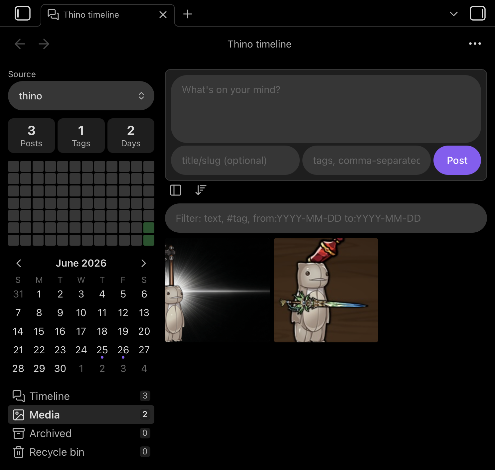
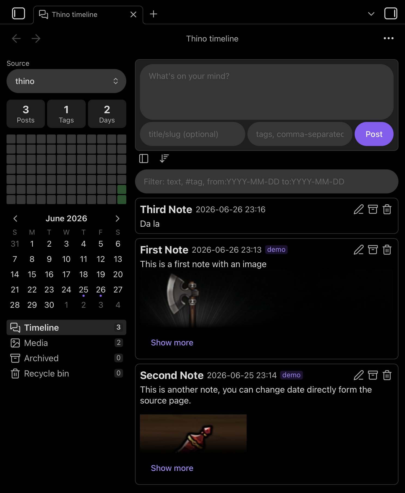

# Thino Files

An [Obsidian](https://obsidian.md) plugin, forked from [Quorafind/Obsidian-Thino](https://github.com/Quorafind/Obsidian-Thino).  

## Features

- Supports desktop, ios and android.  
- Each post is a Markdown file, easy import as long as the file has the follow format (see file format below).
- Switch between folders to display different timelines (add a folder from setting). 
- Toggle timeline order — newest-first (default) or oldest-first.
- Search on text or tag.
- Collapse if post too long.
- Some side bar stats.
- Media grid view. 
- Recycle bin.   



## File format (If you want to import existing files)

```markdown
---
created: 2026-06-12T14:30:22
tags: [idea, project]
---

Post body goes here. Full **GFM** supported.

- [ ] A task item
```

- `created` — creation timestamp, set once. "Last edited" is the file's mtime (no `updated` field). Older files using `date:` are still read (and any other date-valued frontmatter property is used as a fallback); the value is rewritten as `created:` the next time the post is saved.
- `tags` — live only in frontmatter; inline `#hashtags` in the body are treated as plain content.
- `archived` / `deleted` — optional `true` flags set by the archive/delete actions; absent means active, so v0.1.0 files need no migration.

## Installation (BRAT — recommended)

[BRAT](https://github.com/TfTHacker/obsidian42-brat) installs and auto-updates the plugin straight from GitHub Releases — no manual file copying.

1. Install **BRAT** from **Settings → Community plugins → Browse** and enable it.
2. Run the command **BRAT: Add a beta plugin for testing**.
3. Paste the repo URL `https://github.com/waazai/thino-files` (or just `waazai/thino-files`) and confirm.
4. Enable **Thino Files** under **Settings → Community plugins**.
5. Open the timeline from the ribbon icon or the command palette ("Thino Files: Open timeline").

BRAT keys off `manifest.json` in the latest GitHub Release, so **BRAT: Check for updates** pulls each new version as it ships.

## Installation (manual)

1. Build (see below) or grab `main.js`, `manifest.json`, `styles.css` from the [latest release](https://github.com/waazai/thino-files/releases/latest).
2. Copy the three files into `<your-vault>/.obsidian/plugins/thino-files/`.
3. In Obsidian: **Settings → Community plugins** → disable Restricted mode → enable **Thino Files**.
4. Open the timeline from the ribbon icon or the command palette ("Thino Files: Open timeline").

## Development

```bash
npm install
npm run dev     # esbuild watch mode
npm run build   # typecheck + production bundle → main.js
npm test        # vitest unit suite
```

For a fast loop, symlink `<vault>/.obsidian/plugins/thino-files` to this repo and reload Obsidian (`Ctrl/Cmd+R`) after changes.

## Releasing (ship to BRAT)

```bash
npm run ship      # bump patch + tag + push + publish GitHub release
```

`npm run ship` runs `npm version patch`, which bumps `package.json`, syncs the same version into `manifest.json` (via `version-bump.mjs`), and creates the commit + tag. It then runs `npm run release`, which pushes the tag and calls `release.sh` to build the production bundle and publish a GitHub Release with `main.js`, `manifest.json`, and `styles.css` attached — the three assets BRAT downloads.

- For a minor/major bump, run `npm version minor` / `npm version major` first, then `npm run release`.
- Requires the [`gh`](https://cli.github.com) CLI authenticated against `waazai/thino-files`.
- BRAT reads the version from `manifest.json`, so it must match the release tag (the pipeline keeps them in sync; `release.sh` warns if they drift).
